# VoiceBrew / Blostem clone — **v2 handoff** (the feature & content benchmark)

> **Why this file exists:** v2 was accidentally overwritten once by the v3/v4 design work. This document is the **team source of truth** for *what v2 is*, *how to tell it's intact*, and *how to restore it* if it's lost again. Read this before touching the shell, theme, dashboard, or campaign wizard.

_Last verified: 2026-06-22 — all routes 200, no compile errors. Pinned in git as tag **`v2-baseline`**._

📸 **Canonical visual reference: see [§9 Snapshots](#9-snapshots--the-exact-look) at the bottom** (full set in [`./v2-snapshots/`](./v2-snapshots/)). Rebuild to match these pixel-for-pixel.

> **New here?** Jump to [§0 Getting started](#0-getting-started-for-the-team). Paths in this doc are **relative to the repo root** (the folder containing this file) unless noted.

---

## 0. Getting started (for the team)

**Stack:** Next.js 16 (App Router) · React 19 · Tailwind v4 (`@theme` tokens in `globals.css`) · Base UI + shadcn-style components · TypeScript. Local demo only — all data is **mock/fake** (`src/lib/*-mock.ts`), no backend, no real calls.

```bash
# 1. from the repo root
npm install
# 2. run the dev server (port 3434 is the project convention; any port is fine)
PORT=3434 npm run dev
# 3. open
#    http://localhost:3434/dashboard-v2   ← v2 (the main app)
```

- **Node:** use a current LTS (Node 20+; built/verified on Node 24). No `engines` pin.
- **⚠️ Read before coding:** `AGENTS.md` — this Next.js version has breaking changes vs older docs; relevant guides are under `node_modules/next/dist/docs/`.
- **Repo layout:** `src/app` (routes) · `src/components` (`layout/`, `ui/` Base-UI primitives, `ui-bits/` app widgets, `coffee/` brand visuals, `onboarding/`) · `src/lib` (mock data + helpers) · `src/config/nav.ts` (sidebar nav) · `docs/` (product spec, copied in) · `v2-snapshots/` (visual reference) · `scripts/` (tooling).
- **Restore v2 anytime:** `git checkout v2-baseline -- src` (see §6).
- **Branch for your work** off the baseline; don't commit experiments straight onto the v2 line.
- **Sharing:** this repo is currently **local-only** (no remote). To collaborate, push it to your team's private remote (`git remote add origin <url> && git push -u origin main --tags`) — `--tags` carries `v2-baseline`. Keep it private: data is fake but it's an internal product clone.

---

## 1. The version map (three coexisting designs)

| Version | What it is | Where it lives | Shell |
|---|---|---|---|
| **v2** ✅ | The **main app** and the **benchmark for features + content**. Clean, professional, coffee + Playfair. | The whole app; dashboard at **`/dashboard-v2`** | Sidebar + Topbar (global, in `layout.tsx`) |
| **v3** | Brew-enhanced showcase (Calistoga + brew gradient). | **`/dashboard-v3`** | Self-contained (its own nav, `fixed inset-0`) |
| **v4** | "Midnight Pour" cinematic. | **`/dashboard-v4`** | Self-contained (its own nav, `fixed inset-0`) |

**Key rule:** v3 and v4 are **standalone pages** — they render their own shell and read the `--font-brew` (Calistoga) variable directly. They do **not** depend on the global shell or the global `--font-serif`. So you can change v2's shell/theme freely without touching them, and vice-versa.

Run it: `PORT=3434 npm run dev` (from the repo root) → http://localhost:3434/dashboard-v2

---

## 2. The "v2 fingerprint" — the exact settings that make it v2 (not brew)

If any of these drift toward Calistoga / brew-gradient / top-nav, v2 has been clobbered again.

### `src/app/layout.tsx` — global shell
- Imports **`Sidebar`** + **`Topbar`** (NOT `V4Nav`).
- Body renders: `<div className="flex h-screen overflow-hidden"><Sidebar/><div…><Topbar/><main…>{children}</main></div></div>`.
- **No** dark-mode init `<script>`, **no** `suppressHydrationWarning`.
- All four fonts still loaded (Inter, Playfair=`--font-display`, JetBrains=`--font-data`, Calistoga=`--font-brew`). Calistoga stays loaded **only because v3/v4 use it** — v2 itself uses Playfair.

### `src/app/globals.css` — theme
- `--font-serif: var(--font-display), Georgia, serif;`  ← **Playfair** (the line must NOT contain `--font-brew`).
- **No** `.bg-brand { background-image: … gradient … }` override → `bg-brand` is solid bronze (the default `--color-brand` utility). (`.bg-brew` / `.text-brew` may still exist — they're used by v3/v4, harmless to v2.)
- The `.dark { … }` block stays but is **dormant** — nothing sets `.dark` in v2 (no toggle, no init script). It's only for v3/v4.

### `src/components/layout/sidebar.tsx` — brand
- Brand = **`<Headset/>` icon + "Blostem"** (NOT `<Coffee/>` + "VoiceBrew"). Icon bg = `bg-gradient-to-br from-caramel to-mocha`.
- Still contains: ⌘K search trigger, grouped nav (`navGroups`/`nav`), `<WalletMeter/>`, collapse toggle, `data-tour="nav"`.

### `src/components/layout/topbar.tsx`
- Contains: `CapacityChip`, `TopbarGuide`, `NotificationBell`, org switcher, user. **No `ThemeToggle`.**

---

## 3. The v2 dashboard — `src/app/dashboard-v2/page.tsx`

This is the piece that was lost and rebuilt from the transcript. It is the **rich original**, not a summary card layout.

**Must contain (the signature features):**
- `<GetStarted/>` checklist banner.
- "Good morning, Arnika" header + capacity **coffee cup** (`<CoffeeCup/>`/`<CupGlyph/>`), `data-tour="capacity"`.
- A **row of small, FLIPPABLE KPI cards** — `[perspective:900px]` + `[transform-style:preserve-3d]` + `[transform:rotateY(180deg)]` + `[backface-visibility:hidden]`; front = metric + `<MiniSpark/>` + delta, back = detail rows + "View details". Many small metrics (Calls, Connect rate, Conv. rate, Hot leads, durations, channels, etc.), `data-tour="kpis"`.
- **Flippable Live campaigns** (`LiveCampaignsFlip` — list flips to a selected campaign's hot/warm/cold breakdown).
- **Needs attention** list (`data-tour="attention"`), **Outcome mix** `<Donut/>`, **Calls in flight** `<AreaChart/>` (last 14 days).
- `<Tour steps={TOUR} storageKey="vox-tour-dashboard" />`.

**Depends on these components/data (all must exist):**
`@/components/coffee/{coffee-cup,cup-glyph,bean-dot}`, `@/components/ui-bits/{area-chart,donut,mini-spark,help-hint,page-header}`, `@/components/onboarding/{tour,get-started}`, `@/lib/channel-mock` (`CHANNELS, SLOTS_PER_CHANNEL, CAPACITY, HEALTHY_CEILING, baselineActive, connectRate, conversionsToday, liveCampaigns, attention, outcomeMix`), `@/lib/data` (`overviewStats, timeSeries`), `@/lib/format` (`formatDuration, formatINR`), `@/lib/use-live-capacity`.

> ❗ Do **not** replace this with a NumberFlow/Lottie/framer "brew hero." That is the v3/v4 look. v2 = Playfair + coffee + flip cards, no motion libraries.

---

## 4. The campaign journey — `src/app/campaigns/advanced/page.tsx`

The "Advanced" button on `/campaigns` opens this (3-column: step rail · form · live summary). It must mirror the **screen-recording model** ([`docs/MODEL-FROM-VIDEO.md`](./docs/MODEL-FROM-VIDEO.md) §5). These were lost in a declutter and restored — keep them:

**7 steps:** `basic → schema → customer → scoring → flow → phone → skills`

Per-step crucial info that MUST be present:
- **Basics:** Campaign Name*, **Description**, Agent Name*, Company, Agent Gender, Language, Greeting; collapsible "Calling rules & limits" (Type, Call Reason Tag, Call Start/End IST, Max Concurrent, Daily Limit, compliance note).
- **Lead Schema:** 3 core fields note; per-field row = Label*, Name*, Type, **Default value**, 3 toggles (**Required / Scoring input / Agent-can-see `{field}`**) each with a hover tip explaining its downstream effect; gating (Next disabled until ≥1 field).
- **Customer Data:** `ld_enrich_` auto-prefix note + **stored per-call** note + the "Customer Data agent skill must be enabled" warning.
- **Scoring:** Cold/Warm/Hot buckets (defaults 50/75), pre-score weights (only Scoring-input fields), **9 locked in-call signals** with deltas + **"Add custom adjustment"**.
- **Conversation:** greeting, end-call, system prompt + char counter, Import-from-library, **Variables reference panel** (`{company}/{agent_name}/{agent_gender}/{language}`, `{full_name}/{phone}/{email}`, schema-convo fields, customer-data fields), Objection handlers, Voice/LLM/timing.
- **Agent Skills:** real-time tools list from `agentSkills`; core skills locked "Always on"; **`customer_data` skill flagged "gates step 3"**; optional skills toggleable (`bureau_check`, `take_payment`, `send_sms`, `lookup_account`); "Add custom skill".

**Two things that were broken and are now fixed — don't regress them:**
1. **Hover help works.** Tips use the real Base-UI `Tooltip` (`<Tip>` + `<HelpHint>`), **NOT** native `title=` (which showed nothing). Verified: hovering a ⓘ returns its text.
2. **"Show me how" tour.** Header button dispatches `window.dispatchEvent(new CustomEvent("start-tour"))`; `<Tour steps={ADV_TOUR} storageKey="vox-tour-adv"/>` at the bottom; `data-tour` anchors: `adv-steps, adv-name, adv-help, adv-next, adv-summary`.

Mock data: `src/lib/campaign-config-mock.ts` (`products, coreFields, fieldTypes, campaignTypes2, agentGenders, langs, scoreBands {hot:75,warm:50}, inCallSignals, dispositions (8 built-in), phoneNumbers, backgroundSounds, agentSkills`).

> The **Quick** flow (`/campaigns/quick`, 4 steps Product→Details→Review→Leads) and the older rich builder (`/campaigns/new`, 7 steps) are separate and already complete.

---

## 5. Verify v2 is intact (copy-paste)

```bash
# run from the repo root
# 1) dev server up?  (restart if needed)
curl -s -o /dev/null -w '%{http_code}\n' http://localhost:3434/dashboard-v2   # want 200

# 2) fingerprint checks — each line should print a match
grep -n 'import { Sidebar }' src/app/layout.tsx                               # sidebar shell
grep -n 'font-serif: var(--font-display)' src/app/globals.css                 # Playfair (not brew)
grep -n '"Blostem"\|>Blostem<' src/components/layout/sidebar.tsx              # Blostem brand
grep -n 'backface-visibility' src/app/dashboard-v2/page.tsx                   # flip cards
grep -n 'key: "skills"' src/app/campaigns/advanced/page.tsx                   # Agent Skills step
grep -n 'start-tour' src/app/campaigns/advanced/page.tsx                      # Show-me-how

# 3) these must NOT match (would mean brew/v4 leaked into v2):
! grep -n 'V4Nav' src/app/layout.tsx
! grep -n 'font-brew.*font-serif\|--font-serif: var(--font-brew)' src/app/globals.css
```

If the dev server is down: `PORT=3434 nohup npm run dev > /tmp/voxdev.log 2>&1 & disown` (macOS has no `setsid`; on Windows just `set PORT=3434 && npm run dev`).

---

## 6. If v2 is lost / drifts — recovery

**Primary (everyone, any machine): restore from the `v2-baseline` git tag.**
```bash
git checkout v2-baseline -- src/app/dashboard-v2/page.tsx     # just the dashboard
git checkout v2-baseline -- src                               # the whole app
git diff v2-baseline -- src                                   # what changed vs baseline
```
Make a new baseline after an approved v2 change: `git tag -f v2-baseline && # (commit first)`.

**Fallback (original author's machine only):** the dashboard was first rebuilt by replaying edits out of the Claude session transcript at `~/.claude/projects/-Users-apple/7dbdfdad-993a-411a-b9c3-c0f82e0fcc62.jsonl` — base Write at line 1531, then every Edit with `1531 < line < 5410` (5410+ are the v3/v4 rewrites). Only relevant if the git tag is ever lost; teammates on other machines should rely on the tag.

---

## 7. Orphaned files (NOT v2 — leave them, used by or left over from v3/v4)
- `src/components/layout/v4-nav.tsx` — the v4 top-nav; unused by v2 (don't import it into `layout.tsx`).
- `src/components/layout/theme-toggle.tsx` — dark-mode toggle; unused by v2.
- `src/app/dashboard-v3/`, `src/app/dashboard-v4/` — the separate v3/v4 links. Keep.
- `src/lib/voicewave.json`, `@number-flow/react`, `lottie-react`, `framer-motion` — v3/v4 deps; not used by v2.

---

## 8. Reference docs (in-repo, [`./docs/`](./docs/))
- [`docs/MODEL-FROM-VIDEO.md`](./docs/MODEL-FROM-VIDEO.md) — the full model extracted from the original-platform screen recording (the campaign-journey spec lives here; §5 drives the Advanced wizard).
- [`docs/SITEMAP.md`](./docs/SITEMAP.md) — route/screen map. [`docs/DASHBOARD-SPEC.md`](./docs/DASHBOARD-SPEC.md) — dashboard intent.
- Additional working notes (`MODEL-FINDINGS-raw.txt`, `MODEL-V4-SPEC.md`, `RESEARCH.md`, `HANDOFF-PITCH.md`) stay with the original author — ask if you need them.

---

## 9. Snapshots — the exact look

Captured **2026-06-22**, light theme, 1440px viewport, full-page. These are the canonical visual reference — if a rebuild doesn't look like these, it isn't v2. Files live in [`./v2-snapshots/`](./v2-snapshots/).

### Shell + dashboard
**Dashboard (`/dashboard-v2`)** — sidebar (Blostem), get-started checklist, "Good morning" header, capacity coffee-cup, the row of small **flippable** KPI cards, flippable live campaigns, outcome donut, calls-in-flight chart.

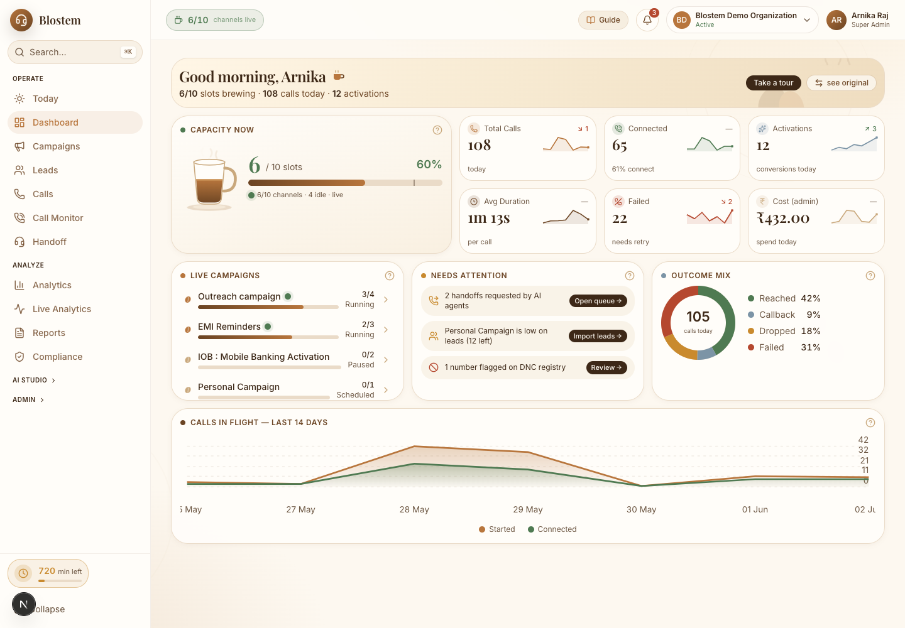

### Campaigns
**List (`/campaigns`)**

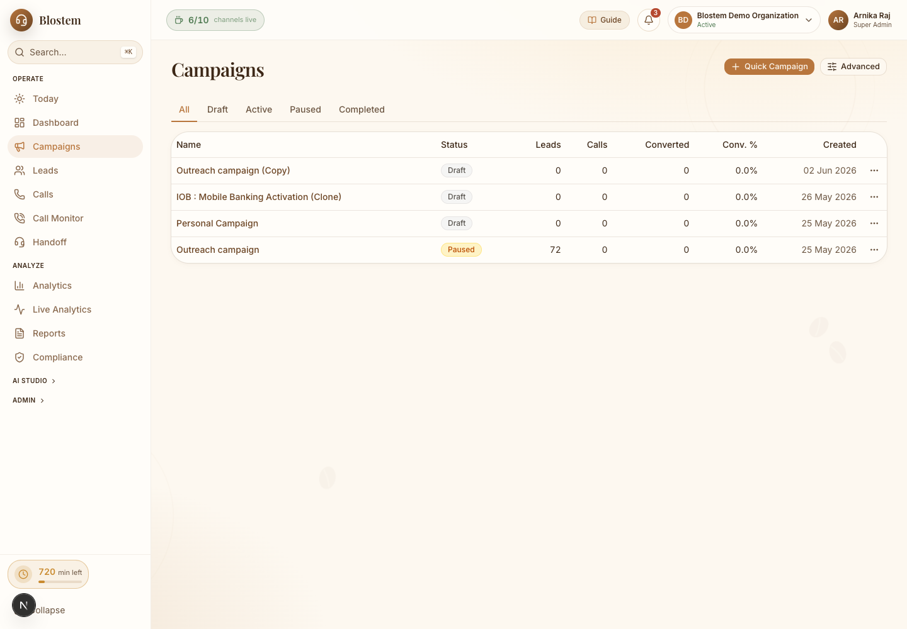

**Quick flow (`/campaigns/quick`)** — Product → Details → Review → Leads.

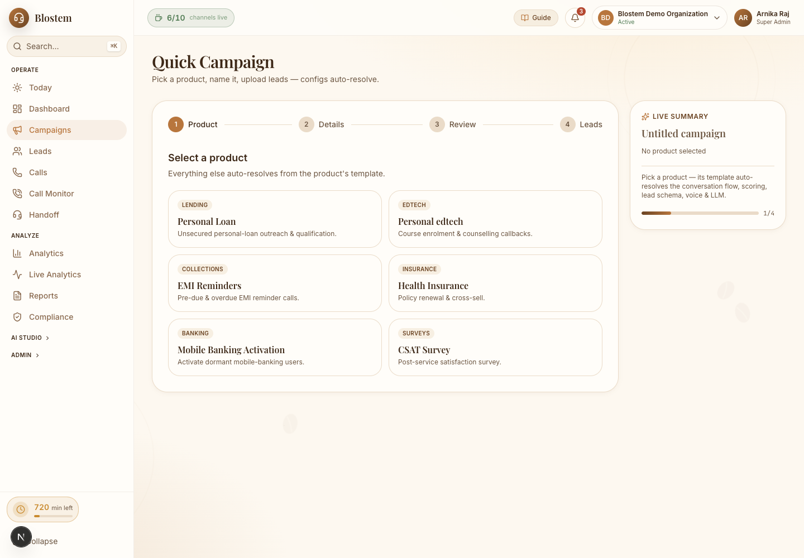

### Campaign journey — Advanced wizard (`/campaigns/advanced`), all 7 steps
1. **Basics** — Description field, info icons (real hover help), "Show me how", calling-rules disclosure.
   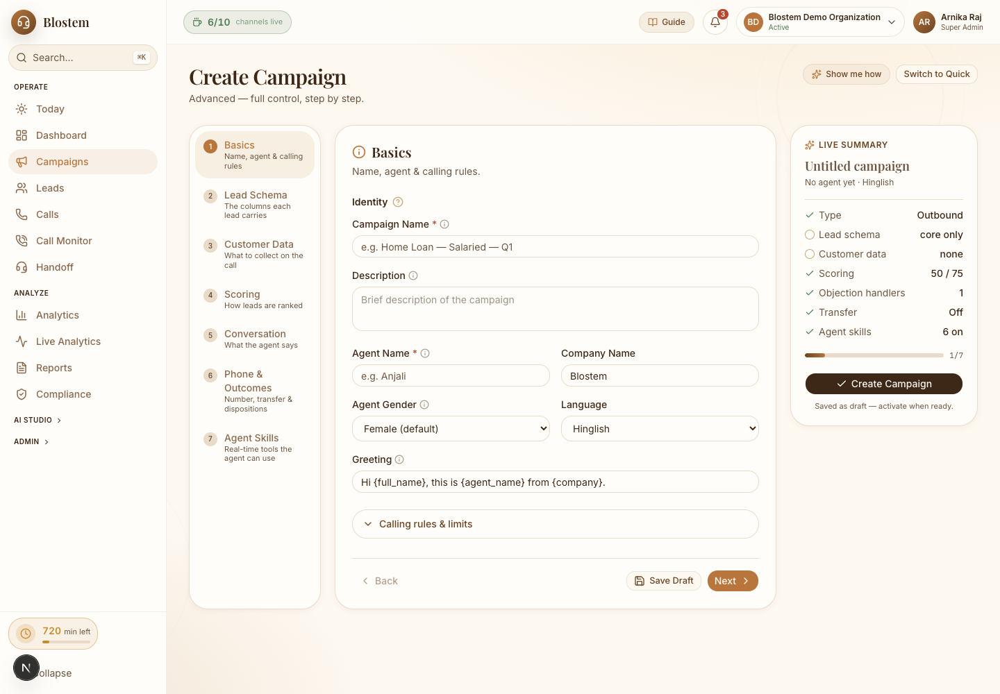
2. **Lead Schema** — Label/Name/Type/**Default**, 3 toggles w/ hover tips, gating.
   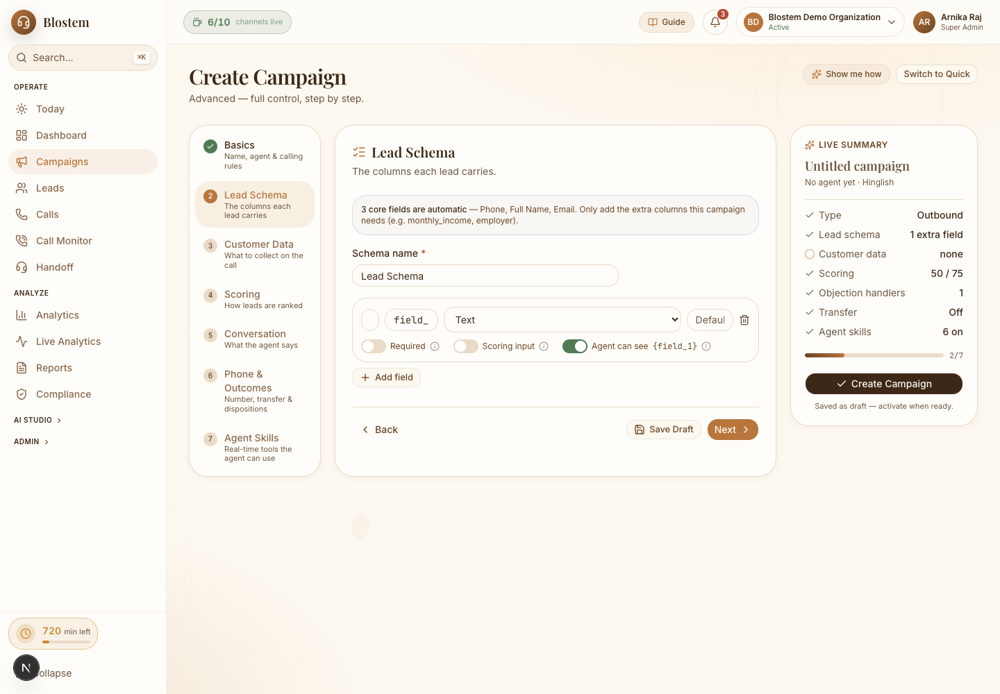
3. **Customer Data** — `ld_enrich_` prefix + per-call + skill-dependency note.
   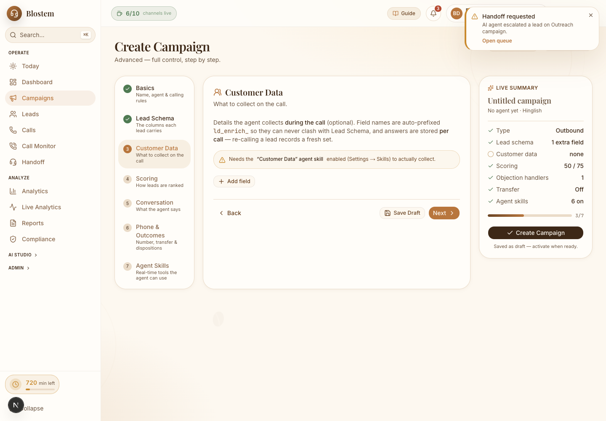
4. **Scoring** — buckets, pre-score weights, 9 in-call signals + add adjustment.
   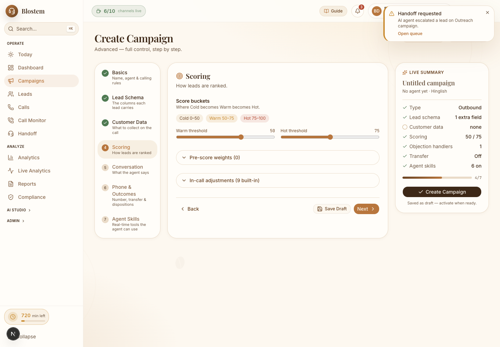
5. **Conversation** — greeting/end/system prompt + **Variables reference panel** + objection handlers.
   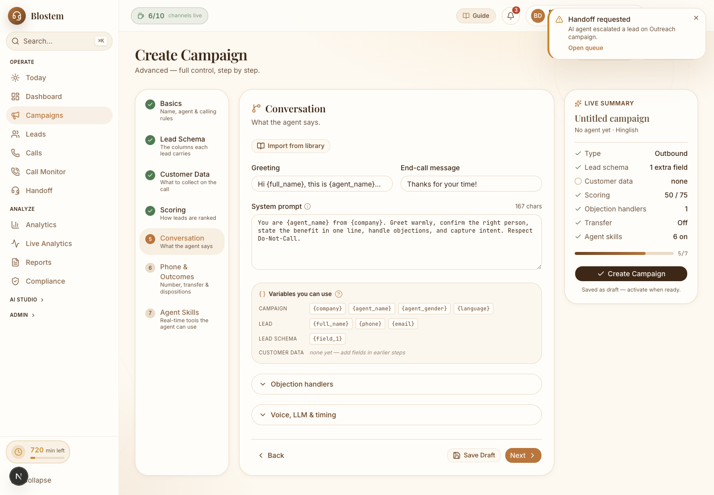
6. **Phone & Outcomes** — number, transfer toggle, 8 locked dispositions + custom.
   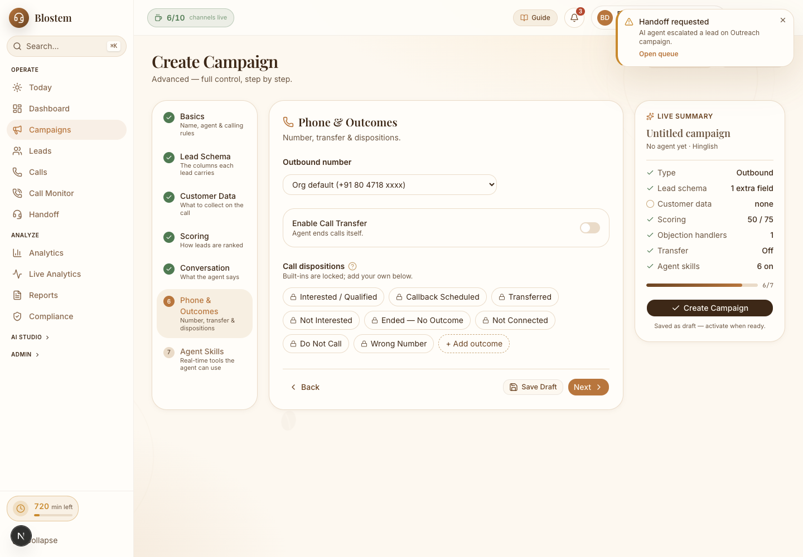
7. **Agent Skills** — real-time tools; core locked "Always on"; `customer_data` "gates step 3"; add custom skill.
   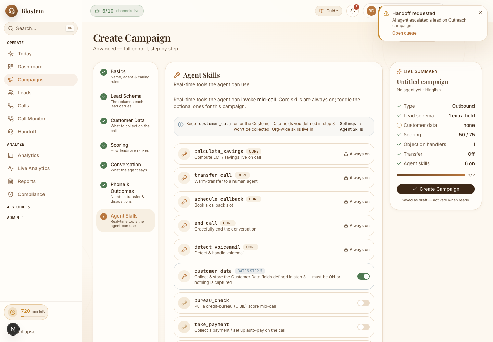

### Other main screens (content benchmark)
| Leads | Calls |
|---|---|
| 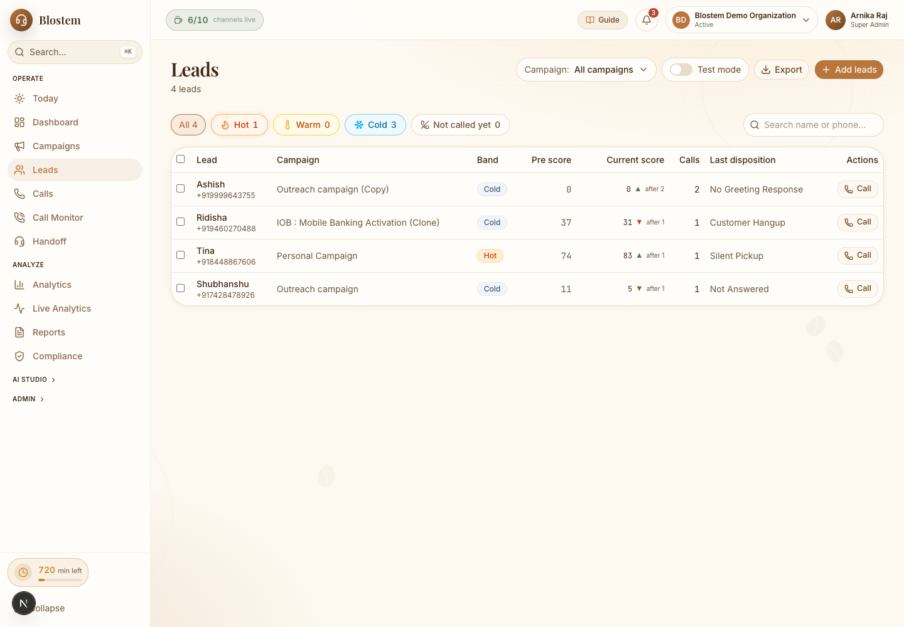 | 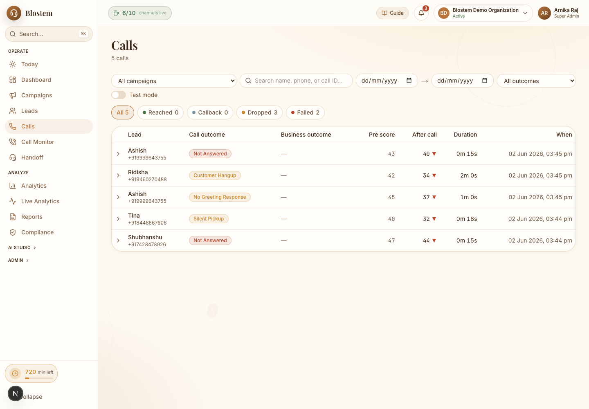 |

| Analytics | Handoff | Settings |
|---|---|---|
| 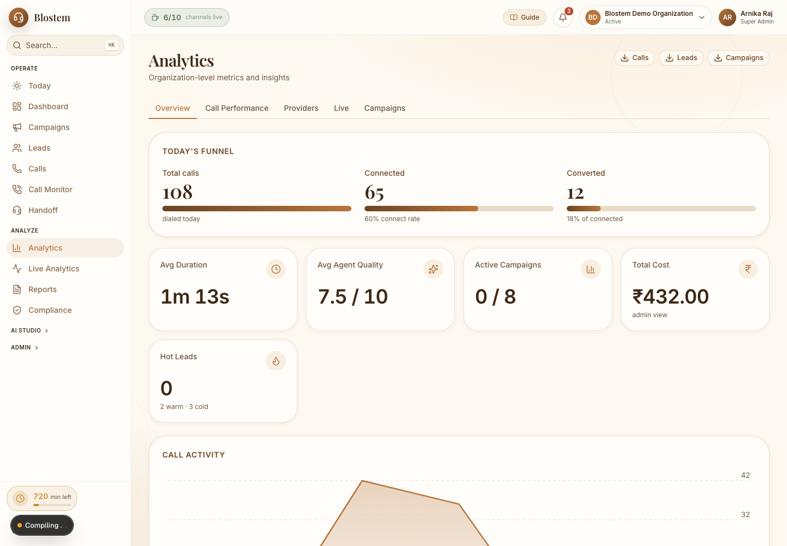 | 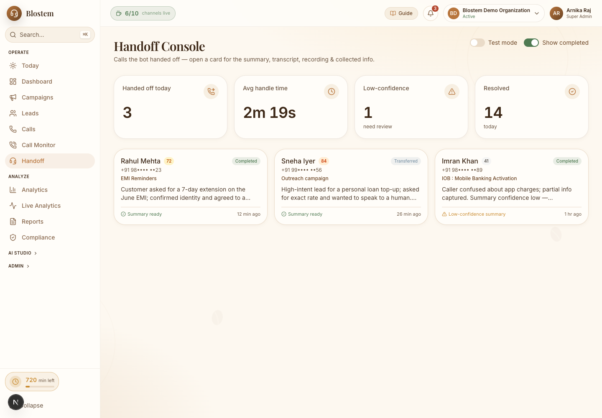 | 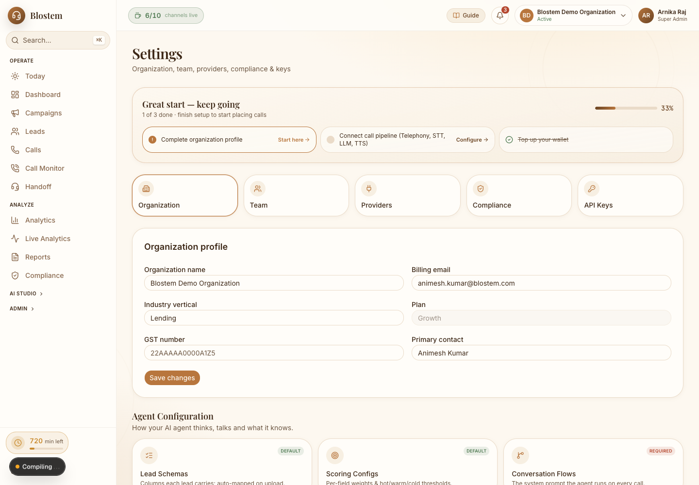 |

> **To refresh these** (only after an intentional v2 change): with the dev server running, `node scripts/snapshot.mjs`. One-time setup: `npm i -D playwright && npx playwright install chromium`. The script is portable (no machine paths) and rewrites every PNG in `v2-snapshots/`. Set `PORT` if you're not on 3434.
